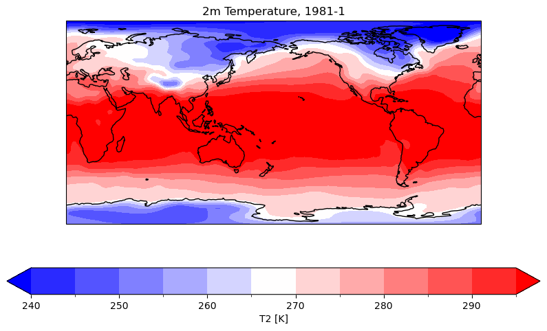

# plot_xgt3

This project provides tools for plotting data from gtool3 files.

## Installation

```bash
pip install git+https://github.com/yourusername/plot_xgt3.git
```

The location of the directory containing Gtool3 axis files must be set as the environment variable `$GTAXDIR`. If you do not have them yet, you can download them from https://github.com/wm-ytakano/gtool3-axis.

## Usage

```Python
# Import module
from plot_xgt3 import quick_plot
import numpy as np

# Set data info
data_dir='./data'
varname='T2'
levels=np.arange(240,300,5)
cmap='bwr'
year=1981
month=1
title=f'2m Temperature, {year}-{month}'

# Plotting
quick_plot(f'{data_dir}/{varname}', 
           levels=levels, cmap=cmap,
           year=year, month=month,
           title=title)
```




## Structure

```
plot_xgt3/
├── plot_xgt3/
│   ├── __init__.py
│   ├── data_loader.py  
│   ├── plotter.py      
│   └── quick_plot.py   
├── development/
│   ├── demo.ipynb
│   ├── sample.png
├── setup.py
├── requirements.txt
└── README.md
```

### Description of Each Script

- `plot_xgt3/__init__.py`: Initializes the `plot_xgt3` package and imports key components for easy access.
- `plot_xgt3/data_loader.py`: Contains the `DataLoader` abstract base class and the `Gtool3DataLoader` class for loading data from XGT3 files.
- `plot_xgt3/plotter.py`: Defines the `Plotter` abstract base class and the `ContourPlotter` class for plotting data using matplotlib and cartopy.
- `plot_xgt3/quick_plot.py`: Provides the `quick_plot` function, a high-level interface for loading and plotting data, with error handling.
- `development/demo.ipynb`: Jupyter Notebook demonstrating how to use the `quick_plot` function and other components of the package.
- `development/sample.png`: Sample output image generated by the `quick_plot` function.
- `setup.py`: Script for setting up the package, including dependencies.
- `requirements.txt`: Lists the dependencies needed for the project.
- `README.md`: Provides an overview of the project, including installation and usage instructions.


---
© 2024 Kanon Kino. All rights reserved.